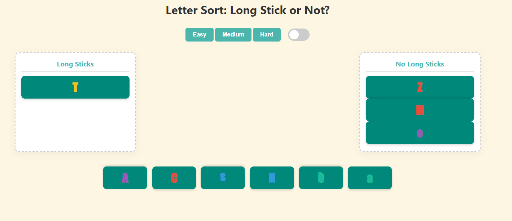
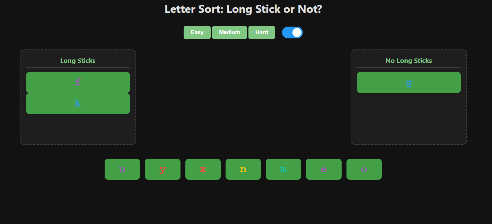

# Letter Sort

Gra edukacyjna do nauki foniki i rozpoznawania liter na podstawie ich wyglądu. Zadaniem gracza jest **przeciąganie liter** do odpowiednich kolumn w zależności od tego, czy litera zawiera **długi pionowy słupek** (`Long Stick`) czy nie (`No Long Stick`).

---

## Funkcje

- **3 poziomy trudności**:  
  - `Easy` – proste małe litery  
  - `Medium` – różne czcionki i kolory  
  - `Hard` – duże litery, losowa rotacja

- **Tryb ciemny** – przełączany eleganckim suwakiem

- **Odtwarzanie dźwięków liter** przy przeciąganiu

- **Dźwięki sukcesu/błędu** przy wrzucaniu liter do kolumny

- **Reset po każdej rundzie** z nowym zestawem losowych liter

---

## Podgląd

Trudny Trudny:

---

Poziom średni z ciemnym trybem:

---